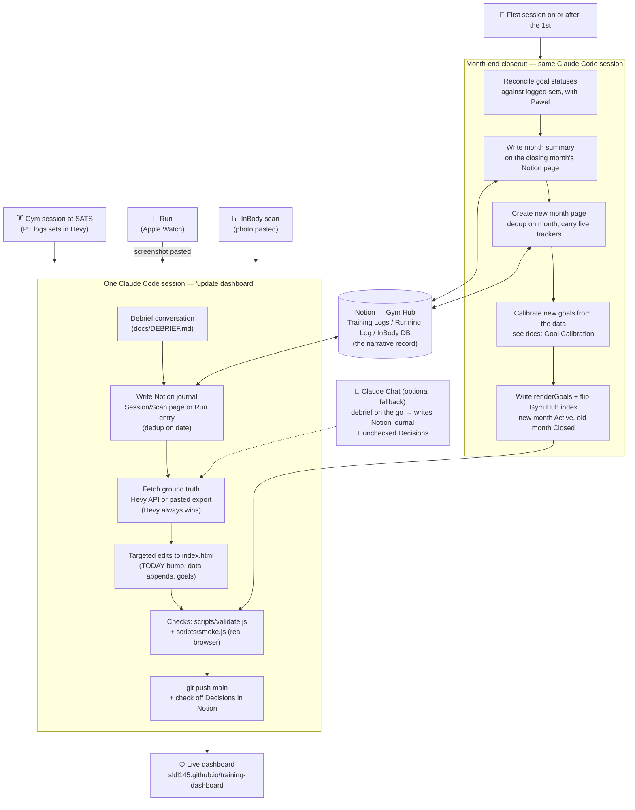

# Training Dashboard

Pawel's training, body composition, and running dashboard — one self-contained page
(`index.html`), live at **https://sldl145.github.io/training-dashboard/** (GitHub Pages,
serves `main`; a push is a publish).

Maintained directly by Claude Code sessions. The full contract is in [`CLAUDE.md`](CLAUDE.md);
detailed manuals live in [`docs/`](docs/).

## How the system works

> **Rule (inherited from the old workflows.html):** any change to this workflow must
> update this diagram AND [`workflows.html`](workflows.html) (the Pawel-facing visual
> guide, served on Pages next to the dashboard) in the same session.

- **Notion** is the narrative record (journals, flags, decisions, scan database) —
  everything hangs off the Gym Hub page.
- **Hevy** is ground truth for lifting numbers; any conflicting verbal/PT number is
  corrected to the Hevy sets with an annotation.
- **This repo** is the rendered dashboard and the system of record for how updates work.

## Repo map

| Path | Purpose |
|------|---------|
| `index.html` | The dashboard (Training / Body Composition / Running tabs) |
| `workflows.html` | Visual "how to update" guide for the three flows — live at [/workflows.html](https://sldl145.github.io/training-dashboard/workflows.html) |
| `CLAUDE.md` | Session contract: workflow, house rules, conventions |
| `docs/GYM_DASHBOARD_INSTRUCTIONS.md` | Full operating manual (Hevy mapping, data rules, goals, graveyard) |
| `docs/DEBRIEF.md` | Post-session conversation guide + Notion journal formats |
| `docs/RUNNING_TAB_SPEC.md` | Running tab spec (data model, plan curve, readiness) |
| `docs/DEPLOYMENT.md` | Hosting, publishing rules, troubleshooting |
| `scripts/validate.js` | Data consistency + syntax + button wiring + TODAY freshness — must exit 0 |
| `scripts/smoke.js` | Headless-Chromium render check of all three tabs — must pass |
| `assets/` | Vendored Chart.js + html2pdf (page has no external dependencies) |
